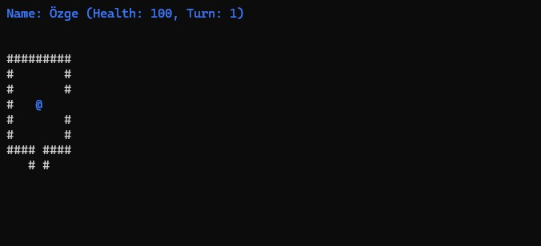
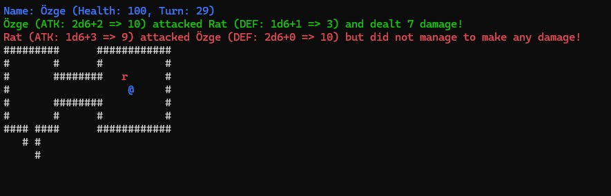
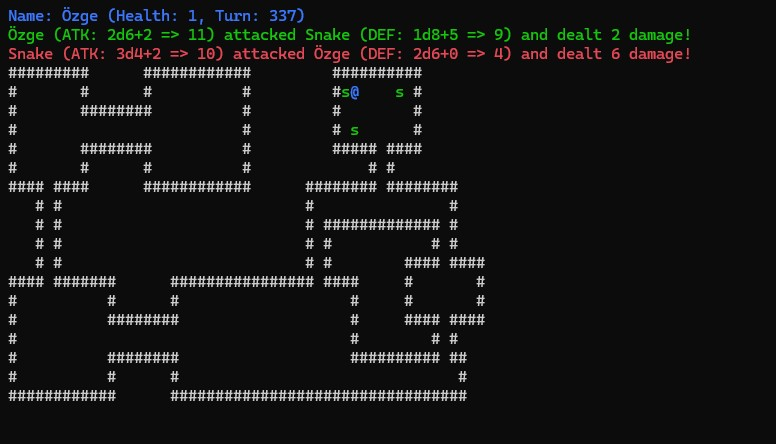
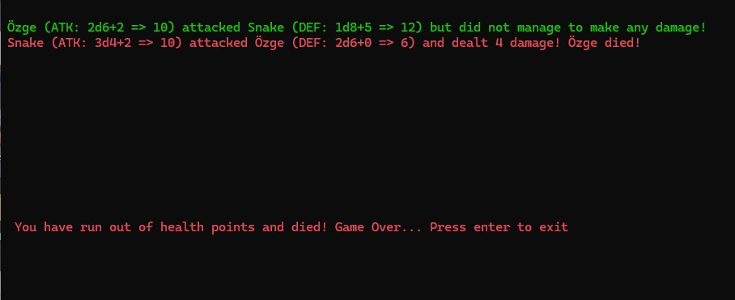

## DungeonCrawler
A simplified Dungeon Crawler built as a C# console application. Players explore a predefined dungeon, fight enemies, and experience a turn-based roguelike inspired game using core object-oriented principles. 

This project was developed as Lab 2 in the programming studies, with a focus on object-oriented design. It has since been refactored as part of a course in 
Database Development & Administration. The application now uses MongoDB to enable the user to save a game and return to it at a later time. 

## Prerequisites
- .NET 8
- MongoDB Compass

## To run DungeonCrawler
1. Clone the repository
2. Connect MongoDB Compass to localhost 
3. Run the application

## Game Overview

**Features**
- Object-Oriented Design:
 Abstract base class LevelElement with derived LivingElement for all entities having health, movement, and combat (Player, Rat, Snake).
 Specific classes for walls and enemies with unique behaviors.

## Gameplay & Combat

- Enemy behaviour:
 Rats move randomly; snakes move away when player is near.

- Level Loading:
 Parses dungeon layout from text file and dynamically creates game objects.

- Turn-Based Game Loop:
 Player and enemies take sequential turns with console rendering each turn.

- Fog of War:
 Player vision limited by radius; walls remain visible once discovered; enemies vanish outside vision.

- Combat System:
 Dice-based attack and defense mechanics with damage calculation, counterattacks, and death handling.

## Game Over

**Technical Summary**
- OOP Concepts:
 Utilizes abstraction, inheritance, and polymorphism with abstract classes and overridden methods (Update(), ShouldAttack()).

- Encapsulation:
 Classes manage their own state and behavior (position, HP, dice rolls, movement, combat).

- Collections:
 Uses List<LevelElement> to manage game entities and LINQ for removal of dead enemies.

- Constructors:
 Initialize objects with specific attributes like health, attack/defense dice, and display color.

- Game Loop & Input:
 GameLoop class handles input, game state updates, and redraws each turn.
